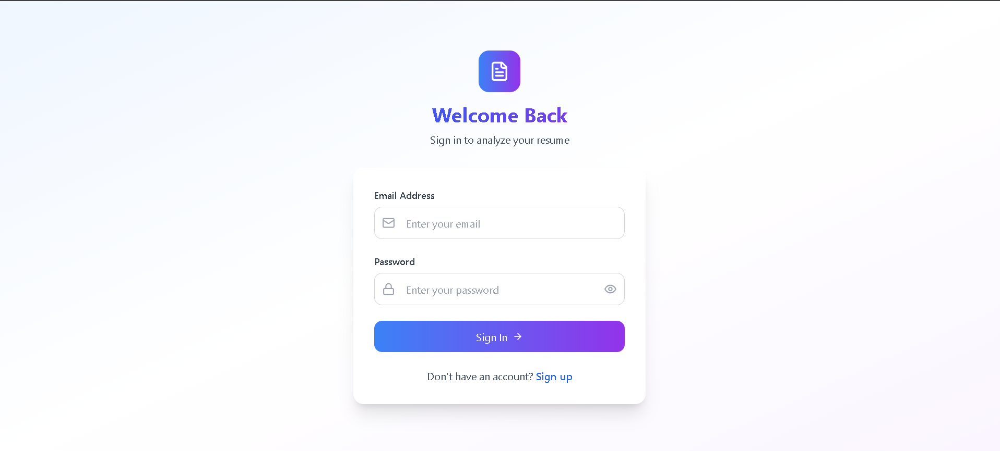
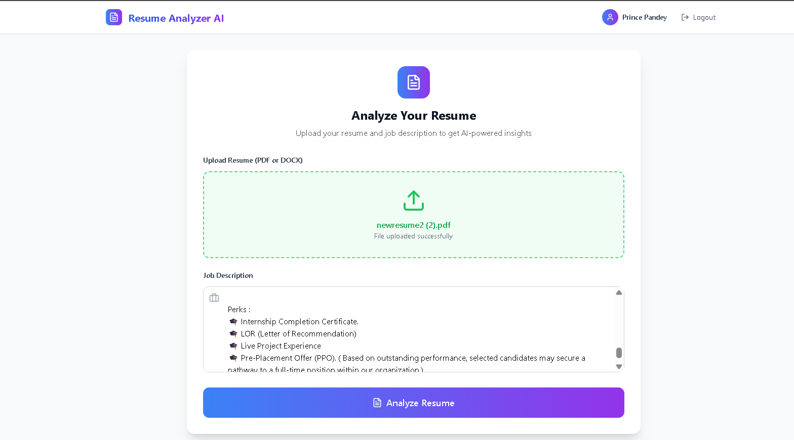
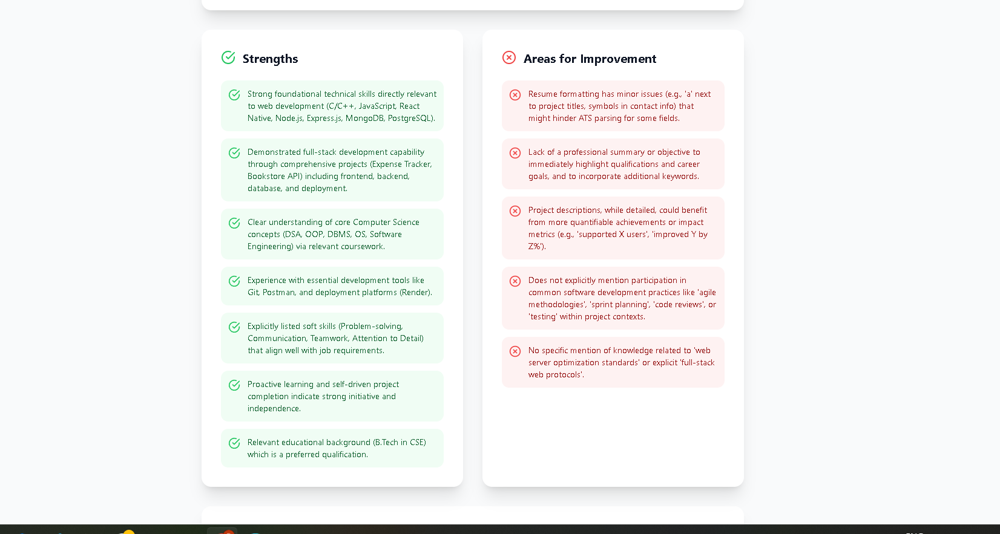
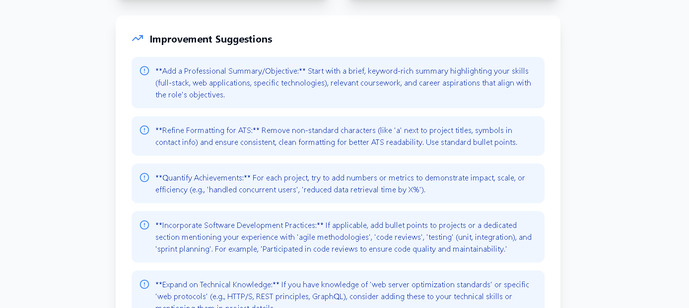

# AI Resume Analysis App

A full-stack application for AI-powered resume analysis with ATS scoring. Upload your resume and job description to get detailed insights, keyword matching, and improvement suggestions.

## 🚀 Features

- **User Authentication**: Secure JWT-based login/registration
- **Resume Upload**: PDF/DOCX support with drag-and-drop
- **ATS Analysis**: AI-powered scoring (0-100) with detailed feedback
- **Keyword Matching**: Identifies missing keywords and match percentages
- **Responsive Design**: Works on desktop, tablet, and mobile
- **Real-time Analysis**: Instant feedback with loading states

## 🛠️ Tech Stack

**Frontend:**

- React 18 + TypeScript
- Tailwind CSS
- Vite
- React Router
- Axios

**Backend:**

- Node.js + Express
- MongoDB + Mongoose
- JWT Authentication
- Multer (file upload)
- bcryptjs (password hashing)

## 🖼️ App Screenshots

### 🔐 Login Page



### 📤 Resume Upload



### 📊 ATS Analysis Results






## 📋 Prerequisites

- Node.js (v16+)
- MongoDB (local or cloud)
- npm or yarn

## 🚀 Quick Start

### Backend Setup

1. **Clone and install**

   ```bash
   git clone <repo-url>
   cd backend
   npm install
   ```

2. **Environment variables**

   ```bash
   # Create .env file
   PORT=3000
   MONGODB_URI=mongodb://localhost:27017/resume-analyzer
   JWT_SECRET=your-super-secret-key
   ```

3. **Start server**
   ```bash
   npm start
   ```

### Frontend Setup

1. **Install and start**

   ```bash
   cd frontend
   npm install
   npm run dev
   ```

2. **Open browser**
   Navigate to `http://localhost:5173`

## 🔌 API Endpoints

### Authentication

- `POST /api/auth/register` - User registration
- `POST /api/auth/login` - User login
- `GET /api/auth/profile` - Get user profile

### Resume Analysis

- `POST /api/resume/upload` - Upload resume + job description for analysis

## 📊 Analysis Features

- **ATS Score**: Overall compatibility rating (0-100)
- **Keyword Analysis**: Match percentage and missing keywords
- **Strengths**: Positive aspects of the resume
- **Weaknesses**: Areas needing improvement
- **Suggestions**: Specific improvement recommendations

## 🏗️ Project Structure

```
├── backend/
│   ├── config/db.js
│   ├── middleware/userauth.js
│   ├── model/User.js
│   ├── model/resume.js
│   ├── routes/authroute.js
│   ├── routes/resume.js
│   └── server.js
├── frontend/
│   ├── src/
│   │   ├── components/
│   │   ├── contexts/
│   │   ├── services/
│   │   └── types/
│   └── package.json
```

## 🔒 Security Features

- JWT token authentication
- Password hashing with bcrypt
- File type validation
- Protected routes
- Input sanitization

## 📱 Responsive Design

- Mobile-first approach
- Tailwind CSS breakpoints
- Touch-friendly interfaces
- Optimized for all screen sizes

## 🐛 Troubleshooting

**Login not redirecting:**

- Check if backend is running on port 3000
- Verify JWT token in browser localStorage
- Check browser console for errors

**File upload failing:**

- Ensure file is PDF or DOCX
- Check file size (max 10MB)
- Verify backend multer configuration

**Database connection issues:**

- Ensure MongoDB is running
- Check connection string in .env
- Verify network connectivity

## 📦 Deployment

**Frontend:**

- Build: `npm run build`
- Deploy to Netlify, Vercel, or any static host

**Backend:**

- Use environment variables for production
- Deploy to Heroku, Railway, or VPS
- Use MongoDB Atlas for cloud database

## 📄 License

MIT License
